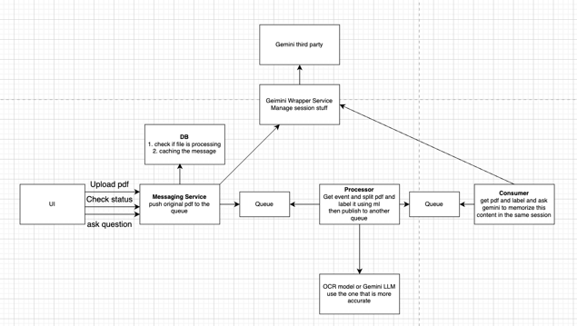

Flow

```
Architecture design
I design to use label technique because I believe that guiding a model to know what is the type of page will help improve the accuracy
I use message queue to make the system scalable but the system will not be real time, it will be eventually consistent
and db/cache for caching the data so we don't waste our resources on the processing
```



How to run project (POC I remove a lot of features)
```
replace GOOGLE_API_KEY in .env file with your api key
```

```
yarn install
```

```
yarn dev
```

Q&A result
```
What’s the size of the bathtub on the second floor?
- The bathtub in the master bathroom on the second floor is a 30" x 60" soaker tub.

What type of cooktop is used for the kitchen?
- The plan specifies a 48" cooktop for the kitchen.

Is weather stripping required for the doors?
- Yes, the elevation notes state to "PROVIDE WEATHER STRIPPING AT ALL EXTERIOR DOORS".

What’s the size of the house number?
- The house numbers are required to be a minimum of 4 inches high with a 1/2-inch wide stroke.
```